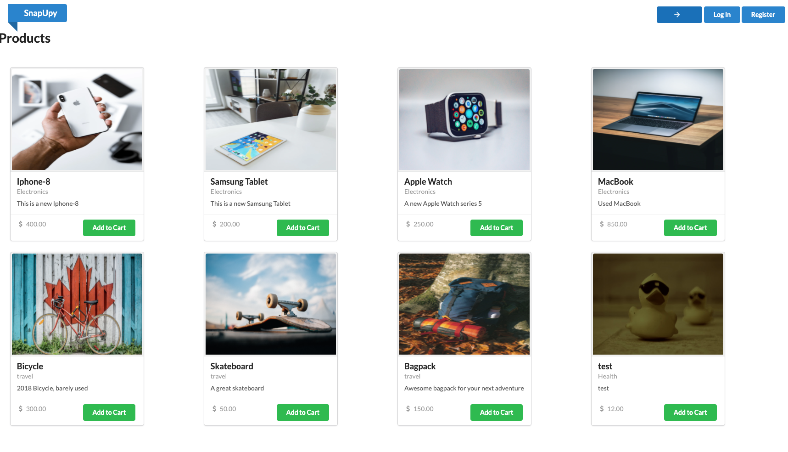
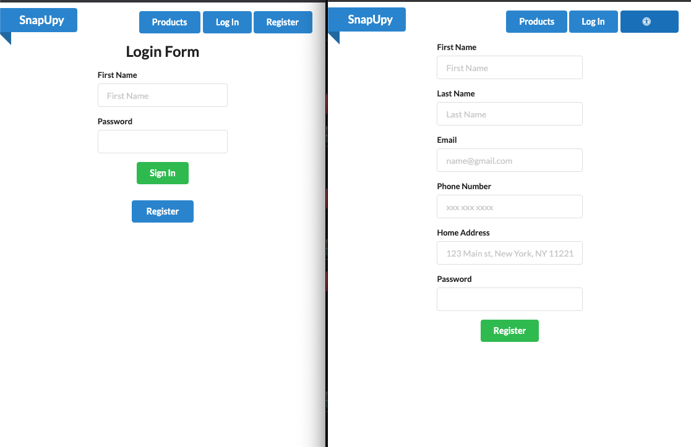
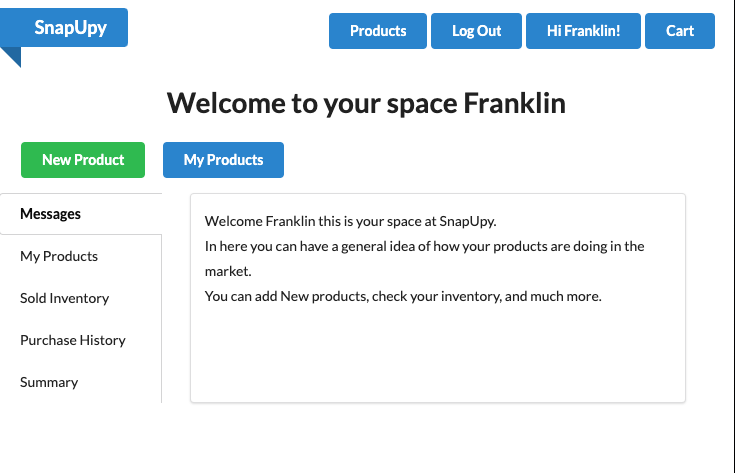
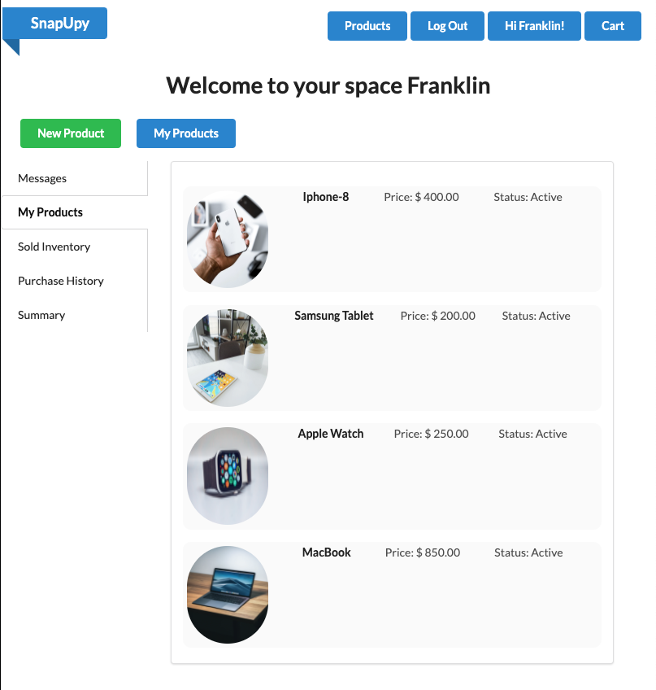
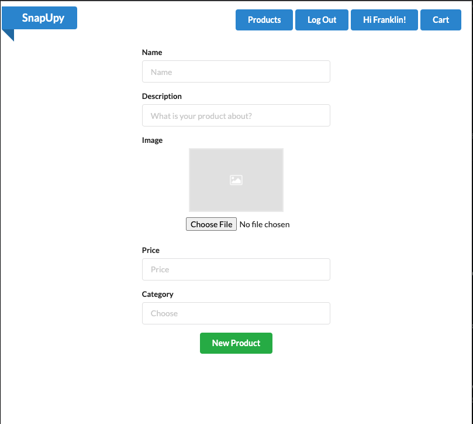
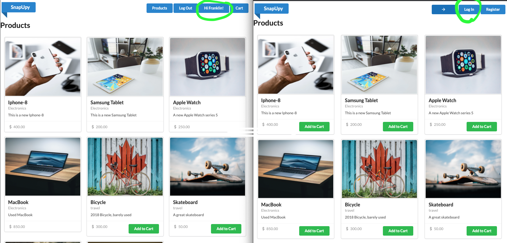
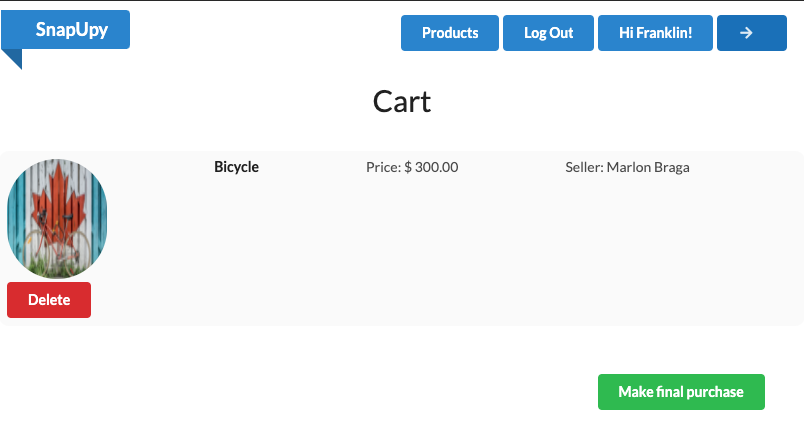
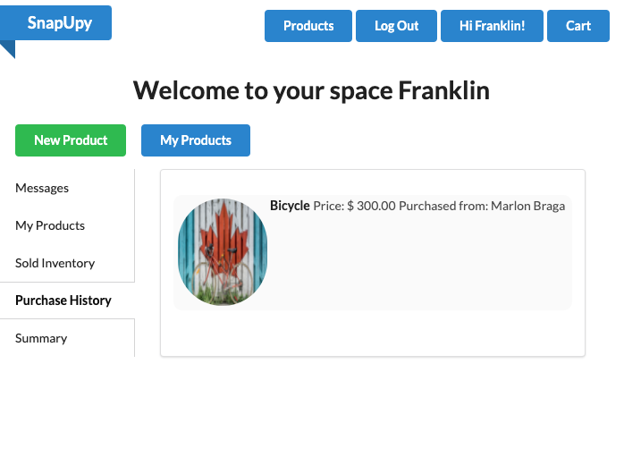
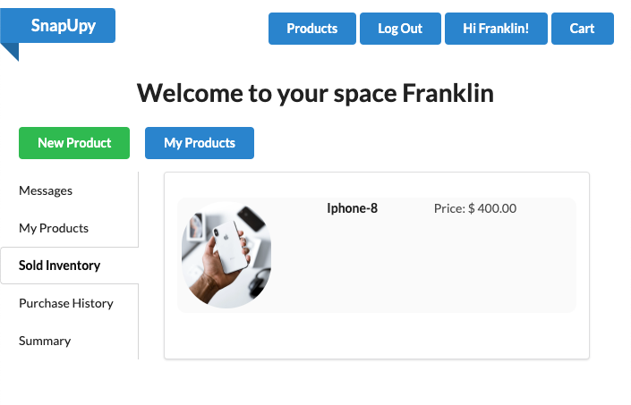

# SnapUpy

SnapUpy is a web application that allows the users to buy and sell products online. 
 

Users are able to search all products on the site without the need to log in or register. At the moment they decided to purchase a good, the system will prompt them to sign in, if they are not.
 
Once the user is signed in, they will be able to check an inventory that will show, thier products, their purchases, and the goods they sold. In here the user is asked to create products so other users can buy them. 

## A Walkthrough on this application

The first thing you will see when using this application is the home page.  

 
From here you can choose to browse the diferent products the site has to offers 
 

But at the moment you wish to buy something, you will be ask to either log in or Sing up. 

 
Once you have signed in, you will be re-direct to your own space 

From here you can view your own products

you can create a new product 

 
The moment you are logged in, and you have created a product, if you go and browse through all the products, the system will allow you to buy only products that are not yours 

 
If you click the add to cart button, you then get redirect to the cart component 

and when you finish the transaction, the rest gets recorded in the inventory space as such 

 
The moment another user buys one of your products, you will be able to see it in the inventory dashboard 

 
 
This is a great project where there is room for improvement. 

## Build Status
Working progress  
The core functionalities are present, but the system has some glitches that will time I will be able to fix. I have also created this project with room for growth in the future, so the structure of this application is flexible, where more functionality will come in the near future. 

## Visit the application live
<a href='https://snapupy.netlify.app/'>SnapUpy </a>

## Technical Overview
This project was build with React.js and elements from Semantic UI for the front-end and Ruby On Rails for the back-end.  
You can find the back-end Repository here <a href='https://github.com/fbado66/shopify_backEnd-assessment'>shopify_backEnd-assessment </a>

